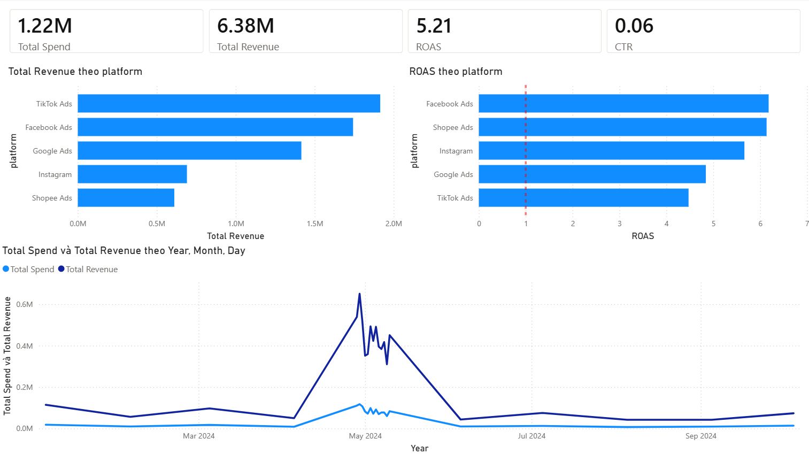
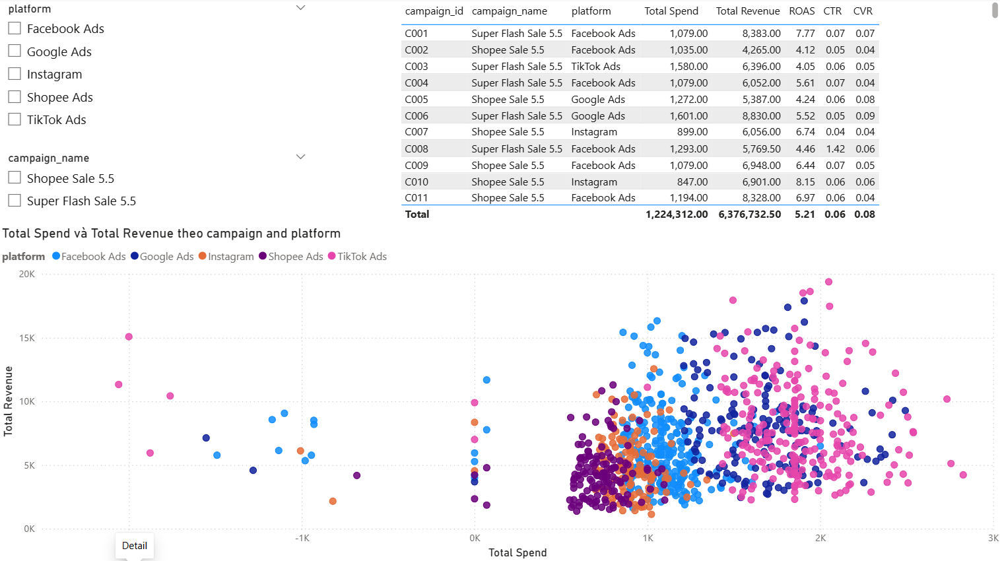

# Shopee Sale 5.5 — Marketing Campaign Analysis

Phân tích hiệu quả **1,000 campaign quảng cáo** trên 5 platform (Facebook Ads, TikTok Ads, Google Ads, Instagram, Shopee Ads) cho chiến dịch **Shopee Sale 5.5**.

---

## Mục tiêu

- Làm sạch raw data có nhiều vấn đề: định dạng không nhất quán, giá trị null, sai kiểu dữ liệu
- Khám phá phân phối dữ liệu, phát hiện outlier và tìm insight
- Xây dựng dashboard interactive để trả lời câu hỏi business:
  - Platform nào hiệu quả nhất trên mỗi đồng chi tiêu?
  - Campaign nào nên tăng/giảm ngân sách?
  - Xu hướng chi tiêu và doanh thu theo thời gian như thế nào?

---

## Tools & Technologies

| Tool | Mục đích |
|------|----------|
| Python (pandas) | Data Cleaning |
| Jupyter Notebook | Exploratory Data Analysis (EDA) |
| Power BI + DAX | Dashboard & Visualization |
| Git | Version Control |

---

## Cấu trúc project

```
shopee-marketing-analysis/
├── data/
│   ├── shopee_sale_5_5_data.xlsx     # Raw data gốc
│   └── shopee_cleaned.xlsx           # Data sau khi clean
├── clean_shopee_data.py              # Script xử lý data
├── eda_shopee.ipynb                  # Notebook EDA
├── shopee_dashboard.pbix             # Power BI dashboard
└── README.md
```

---

## Workflow

### Bước 1 — Data Cleaning (`clean_data.py`)

Raw data có nhiều vấn đề thực tế cần xử lý:

- **campaign_name:** nhiều cách viết khác nhau → chuẩn hóa về 2 loại nhất quán
- **platform:** `fb`, `FB`, `Facebook`, `insta`, `tt ads`... → mapping về tên chuẩn
- **Cột số:** `1.5k`, `1,035`, `574đ`, `1090$`, `N/A`, `null`, `one hundred` → parse về float
- **Giá trị âm:** spend/ âm không có ý nghĩa business → không xác định nguyên nhân thay bằng `NaN`
- **date:** 10+ định dạng khác nhau (`May 6 2024`, `05-02-2024`, `2024.05.06`...) → chuẩn hóa về `YYYY-MM-DD`
- **Missing values:** impute bằng median theo platform để tránh bị kéo lệch bởi outlier

### Bước 2 — EDA (`eda_shopee.ipynb`)

- Phân tích phân phối 5 chỉ số chính: spend, clicks, impressions, conversions, revenue
- Phát hiện và xử lý outlier bằng IQR method
- Phân tích hiệu quả theo platform và campaign
- Xu hướng spend vs revenue theo thời gian
- Correlation matrix giữa các chỉ số

### Bước 3 — Dashboard (Power BI)

## Dashboard Preview

### Trang 1 — Overview



### Trang 2 — Campaign Detail



---

## Hướng dẫn chạy

### Yêu cầu
- Python 3.8+
- Các thư viện: `pandas`, `numpy`, `openpyxl`, `matplotlib`, `seaborn`, `jupyter`

### Cài đặt
```bash
git clone https://github.com/trieunguyenhuu/shopee-marketing-analysis.git
cd shopee-marketing-analysis
python -m venv venv
venv\Scripts\activate        # Windows
pip install -r requirements.txt
```

### Chạy theo thứ tự

**Bước 1 — Data Cleaning**
```bash
python clean_data.py
```
Output: `data/shopee_cleaned.xlsx`

**Bước 2 — EDA**
```bash
jupyter notebook eda_shopee.ipynb
```

**Bước 3 — Dashboard**  
Mở file `shopee_dashboard.pbix` bằng Power BI Desktop.  
Nếu data chưa load: Home → Transform Data → Data Source Settings → đổi đường dẫn đến `data/shopee_cleaned.xlsx` → Refresh.

## Key Insights

**DAX Measures được dùng trong Power BI:**

```dax
Total Spend = SUM(cleaned_data[spend])
Total Revenue = SUM(cleaned_data[revenue])
ROAS = DIVIDE(SUM(cleaned_data[revenue]), SUM(cleaned_data[spend]))
CTR = DIVIDE(SUM(cleaned_data[clicks]), SUM(cleaned_data[impressions]))
CPC = DIVIDE(SUM(cleaned_data[spend]), SUM(cleaned_data[clicks]))
CVR = DIVIDE(SUM(cleaned_data[conversions]), SUM(cleaned_data[clicks]))
```

1. **Shopee Ads có ROAS cao nhất (6.02)** — hiệu quả nhất trên mỗi đồng chi tiêu nhưng đang bị underinvest, ngân sách chỉ bằng ~1/3 TikTok → cơ hội tối ưu ngân sách rõ ràng

2. **TikTok Ads chi tiêu nhiều nhất nhưng ROAS thấp nhất (~4.32)** — revenue tuyệt đối cao do spend lớn, không phải do hiệu quả thực sự

3. **Facebook Ads đứng thứ 2 về ROAS (5.83)** — revenue cao thứ 2 toàn platform, là platform cân bằng tốt giữa scale và hiệu quả

4. **Tất cả platform đều có ROAS > 1** → toàn bộ chiến dịch có lãi về mặt doanh thu

5. **CONVERSIONS có phân phối lệch phải mạnh nhất** (mean=79, median=52) → một số ít campaign tạo ra phần lớn conversion, nên ưu tiên scale các campaign đó

---

## Hướng phát triển tiếp theo

- Phân tích theo `ad_set` để tìm targeting nào hiệu quả nhất
- Dự báo revenue cho campaign tiếp theo bằng time series
- A/B test analysis giữa các ad format

---

## Tác giả

**[Nguyễn Hữu Triệu]**  
[LinkedIn](https://www.linkedin.com/in/trieunguyenhuu/) · [Email](nguyenhuutrieu2004@gmail.com)
